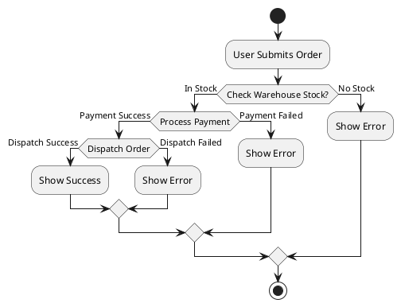
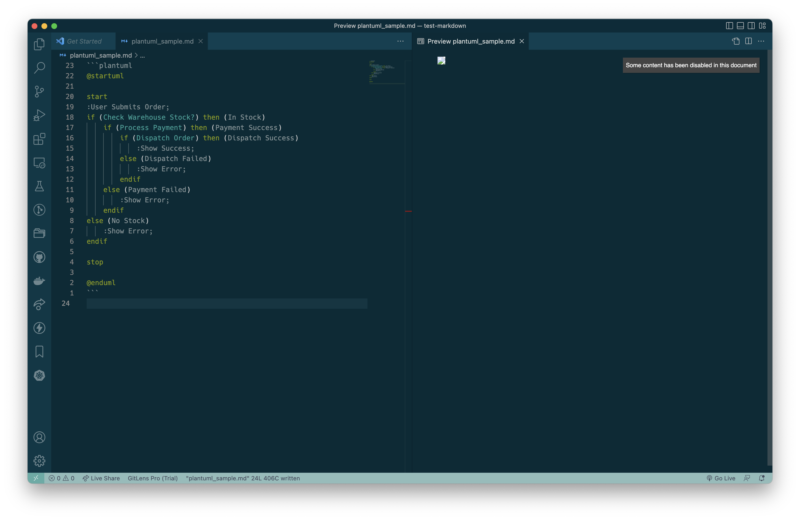
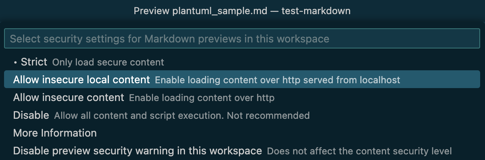
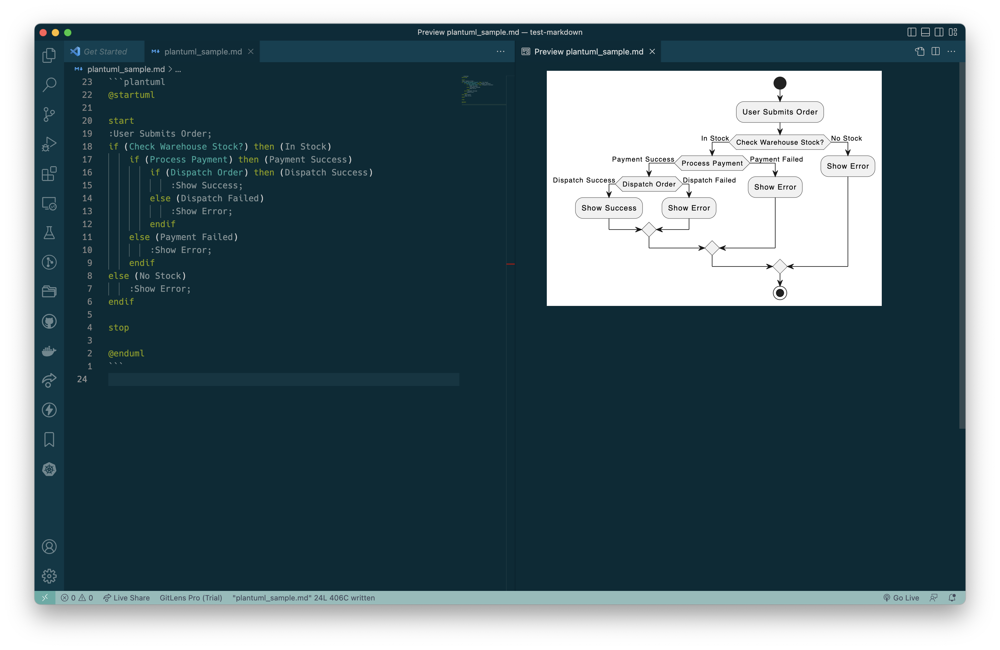

# Configure PlantUML extension in VSCode

VSCode extension:  `jebbs.plantuml`

Once you have been run the plantuml docker on your local, you should configure the settings in VSCode.

<br>

## How to configure

In `settings.json`, types the following settings for `plantuml`.

```yaml
  "plantuml.render": "Local",
  "plantuml.server": "http://localhost:8080",
```

Create a markdown file, then insert the sample plantuml markdown.

````plain

````

If you open the markdown preview, the preview will be blocked and then some button will be displayed on top.

Button: `Some content has been disabled in this document`

Once you click the button, you can see the Markdown Security menu.



Choose the option you want.

I chose the `Allow insecure local content` option.



After done, you can see the renedered plantuml preview.


